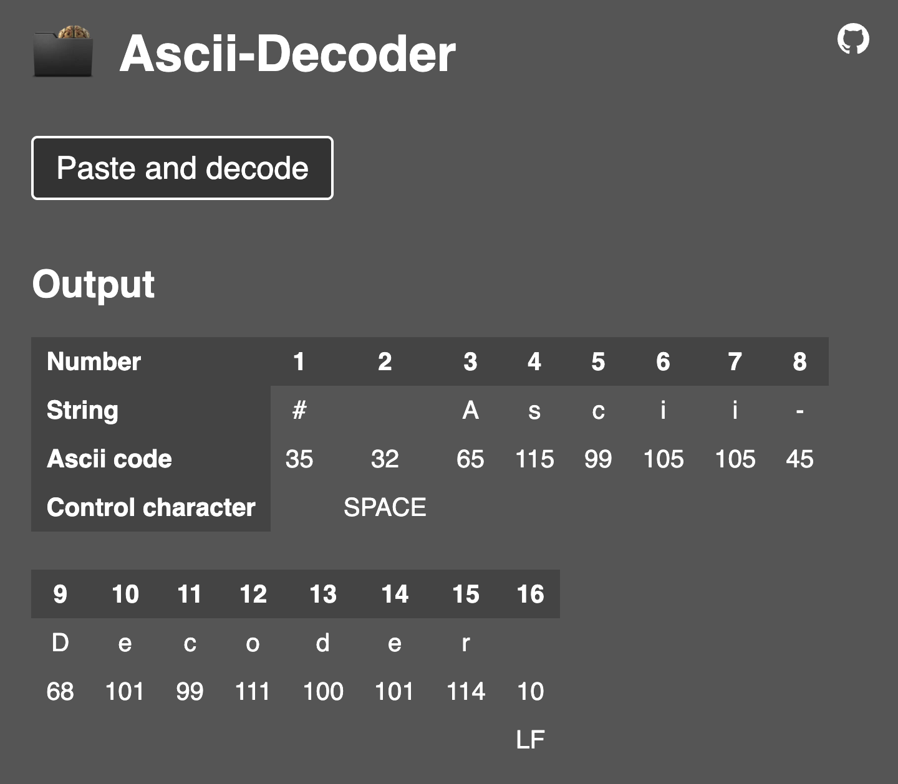

# Ascii-Decoder

*Ascii-Decoder* decodes text from your clipboard to it's decimal ascii code.

Just push the 'Paste and decode' button and watch the table in the output section.
The table has 4 rows:

1. Number: an incremental counter starting at 1
1. String: the single character (all white spaces and new lines are represented by " ")
1. Ascii code: the decimal ascii code of the character above
1. Control character: some of the ascii codes represent [control characters](https://en.wikipedia.org/wiki/ASCII#Control_characters) or a kind of name

## Installation

This repo can simply be cloned on a web server for installation, adaptation and personal use. Remove the 2 lines of PHP code in `index.php` and reactivate and adapt the HTML code lines below. The `index.php` can then also be renamed to `index.html`.
